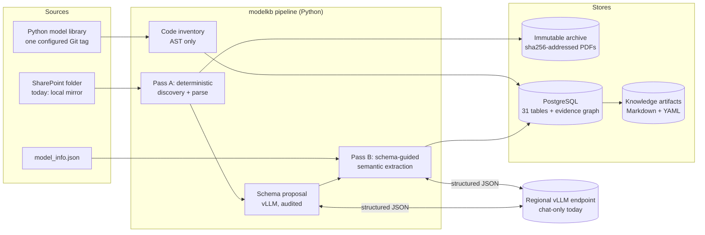
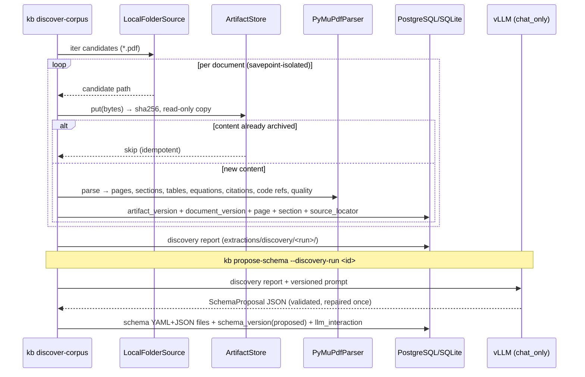
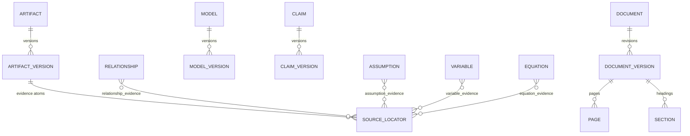

# Architecture — modelkb

Concise system shape. Rationale lives in `adrs/` (0001 versioning,
0002 graph/conflicts, 0003 two-pass schema, 0004 LLM audit, 0005 DB
portability).

## Context



## Pass A flow (implemented, milestones 1–3)



## Pass B flow (planned, milestones 4–7)

```text
active corpus schema
        │
        ▼
per document: deterministic candidates (tables, equations, metadata)
        │  LLM only for classification / normalization / semantic extraction
        ▼
validated JSON (Pydantic) ── nulls, confidence, reasoning_category,
        │                    evidence IDs required per substantive field
        ▼
claims/assumptions/variables/equations/coefficients + evidence links
        │
        ▼
relationship assertions (PDF precedence 20 > model_info 10)
        │  conflicts retained + marked; deterministic resolver → current view
        ▼
Markdown/YAML knowledge artifacts (frontmatter cites evidence IDs)
```

## Evidence and versioning model



* Append-only everywhere; `is_current` moves, history stays.
* `recorded_at` (system) vs `valid_from`/`source_modified_at` (source) time.
* Relationship indexes `ix_relationship_forward/reverse` prepare recursive
  PostgreSQL traversal.

## Deployment view

| Environment | Database | LLM backend | Notes |
|---|---|---|---|
| Dev / tests (today) | SQLite file | `chat_only` (JSON emulation) | zero-install; psycopg not required |
| Shared / prod | PostgreSQL (`KB_DATABASE__URL`) | `chat_only` or `direct` (guided JSON) | JSONB + traversal indexes activate |

Auth seam: no API key today; company auth plugs into
`VllmProvider._headers()` only (ADR 0004).
